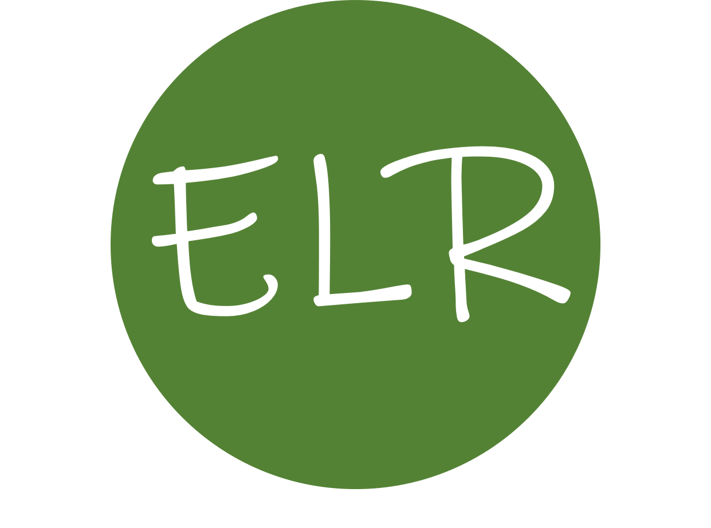

## Welcome to ELR Editing
Ensure your research papers are presented in their best possible form before submission. The language in your paper will be of publication quality after being edited by our experts.

### Our Editors

When you submit your manuscript to *ELR Editing* for English language editing and formatting, your submission will be reviewed with an editor specializing in your field. The editor will understand the terminology unique to your field and has a relevant research background.

*ELR Editing* subject-expert editors:

* are fluent English speakers or scholars working in EU or North America
* have completed a PhD qualification
* have publications in prestigious peer-reviewed journals
* have undergone substantial editing training

### Our editing services

* Language Editing: offering extensive edits to help you get the best out of your papers
* Academic Translation: translating your Chinese manuscripts or documents into authentic English expressions
* Manuscript Formatting: following journal styles to format your manuscript

### Service packages
#### Standard
* Editing into proper and authentic American English
* Edited by PhD or PhD candidates
* Check for logic and flow of content
* Formatting to the journal style
* Check for consistency and article structure

[Contact us](mailto: elr.editing@gmail.com) for more information and pricing.
